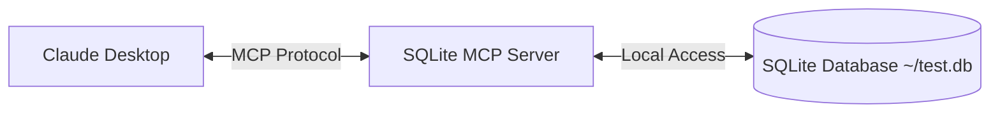

# MCP

from

[話題のClaude新機能！Model Context Protocolについて解説してみた](https://youtu.be/47EtOViVJ1c?si=V-g-Xw84XAFsFWuw)

<https://modelcontextprotocol.io/introduction>

## claude

with desktop

<https://modelcontextprotocol.io/introduction> url was updated. then, using below site.
<https://www.claudemcp.com/docs/quickstart>



```shell
# Open the configuration file
code ~/Library/Application\ Support/Claude/claude_desktop_config.json
```

```json
{
    "mcpServers": {
      "sqlite": {
        "command": "uvx",
        "args": ["mcp-server-sqlite", 
        "--db-path", 
        "{{path_to_your}}/test.db"]
      }
    }
}
```

restart application

and input prompt

`Can you connect to my SQLite database and tell me what products and their prices are?`

run function below

- list_tables
- describe_table
- read_quary

uvx - python
npx - node.js

## cursor

config path

`~/.cursor/mcp.json`

## mcp server store

[smithery](https://smithery.ai/)

build your own mcp server you can use mcp sdk with your native language like ts,py,java, etc.

<https://github.com/modelcontextprotocol/python-sdk>
uv

<https://github.com/modelcontextprotocol/typescript-sdk>
npm
